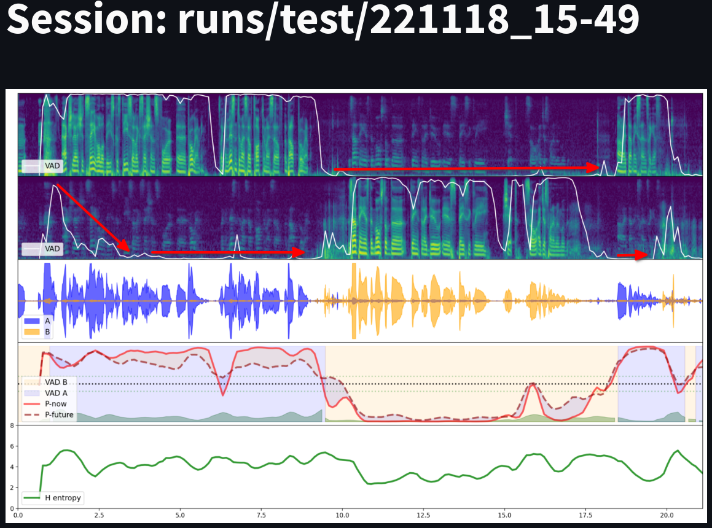

# VAP Agent Notes

#### Organization

* [Overbleed is recognized with context]()
* [Overbleed at onset]()
* [Entropy at turn-shift projections]()

#### Vocabulary
* Turn-taking state:
    - Projection-window state
    - How are the dynamics of activity at this particular moment?
    - An instant "picture" of a turn-taking state.

# Overview Example

# Overbleed is recognized with context

The overbleed in channel 2 is recognized as noise after around a second of speech. We note that the entropy is decreasing over the same period (kinda).

# Entropy
The model outputs a probability distribution covering the states of
projection-windows (or blocks). The Probabilities cover the 256 possible
states, encoded in 8-bits (2^8=256), which means that the maximum amount of
information is 8 bits. This means that the **maximum entropy** for this
prediction is 8 bits.

If there is **uncertainty** about the future turn-taking state the model will have high entropy but if it "thinks" it can predict the future it will show a lower entropy.

* What is the unconditional entropy?
    - Statistics over the total states of the training set.
    - TBD: I have that numbeer somewhere
* What is the actual conditional entropy?
    - Well, this is our best attempt at approximating it.
* What does an increase in entropy, H, mean?
    - The model is increasily more uncertain because a "tricky" turn-taking dynamic space is approaching.
    - At **turn-shifts** where **both** speakers choice of dynamics is the most prominent the complexity should increase.
* What does a decrease in entropy, H, mean?
    - The state is more confidently "known"
    - This should occur in highly predictive turn-taking states... But what are those? One could say that it could be at the end of very common questions. "How are you doing?", "What is your name?", etc should have a fairly clear outcome. But consider that the future at this very likely TRP is still very complex because it involves the listener to a much greater extent than in the previous seconds (except for highly unlikely turn-taking states in a highly dynamic dialog etc). When will they answer? will it be something short? Yes/No question have short replies perhaps followed by another question still in the predictable horizon of the model which could increase entropy.
    - Where is a dialog in its least entropic state?
        - Start of utterances

## at onset

The entropy "generally" decreases at the onset of a new utterance. That
certainty seems greatest over the **first** word but "quickly" increases at the
start of the **second**.

## at turn-shift projections

The entropy "generally" increases at the end of turns which can indicate that the model anticipates a turn-shift. During a turn the model can mostly focus on modelling the current speaker but in proximity to a turn-shift the influence of the second speaker increases which is reflected in the rise in entropy.

# Future and Now Projection Divergence vs Convergence

* Divergence:
    * The future "believes" the turn is ending (in 600-2000ms)
    * The present indicates that the speaker will continue in the immediate future (0-600ms)
* Convergence:
    * *''Observation at start of conversation which feels very noisy''*
    * The convergence indicates a clear next speaker
* Parallel:
    * The present and the future agrees about the current state

# Backchannel

We plot the prediction probability of a backchannel (zero-shot classes) from the "listener".

* Common at the end of turns?
* Common inside turns?
    * phrase boundaries
    * breath groups

# Fillers

# Silence

# Silence with filler

---------------------------------------------

# Add ASR with some text so we can look at TurnGPT

